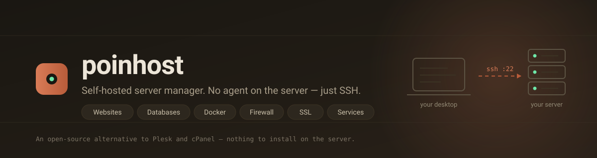
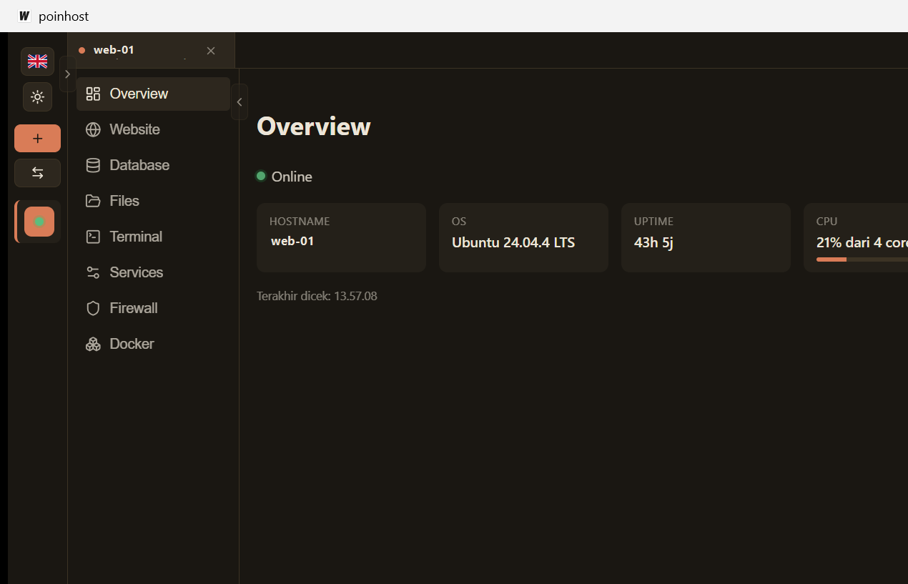
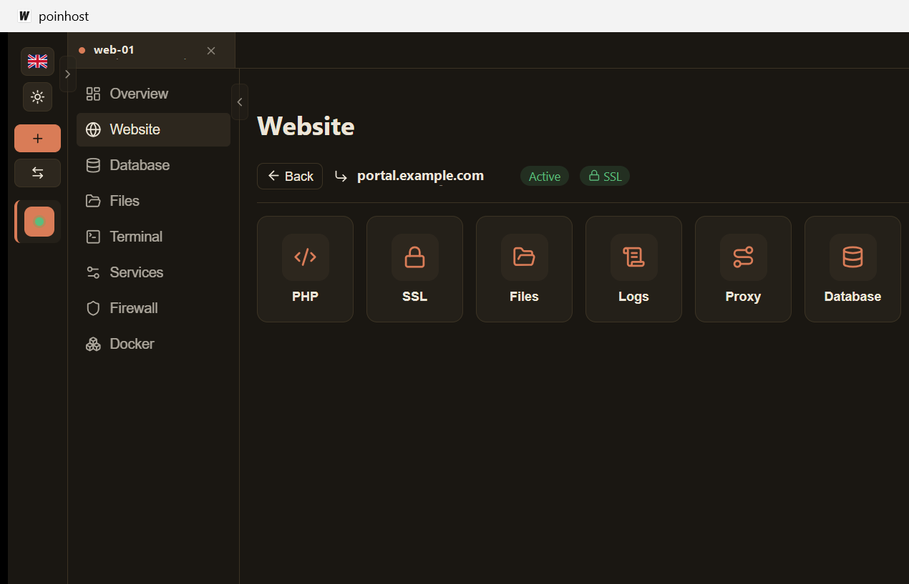
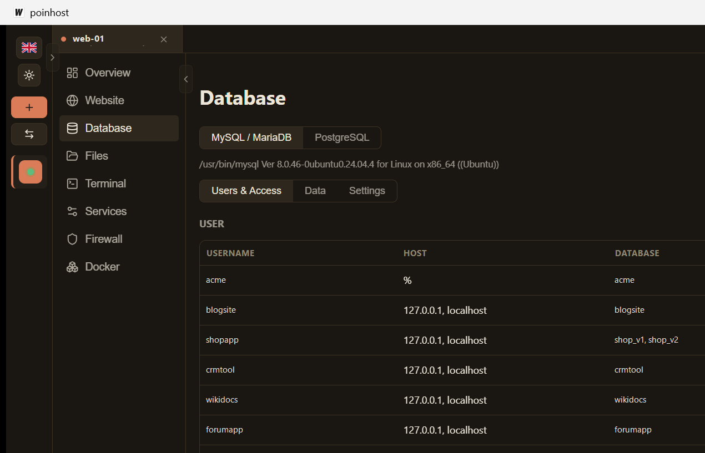
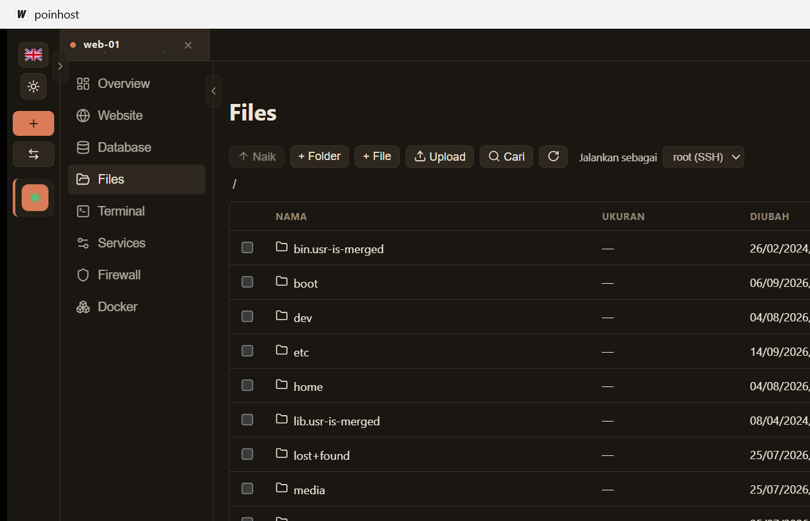
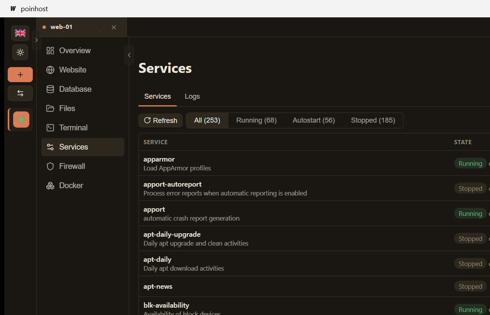
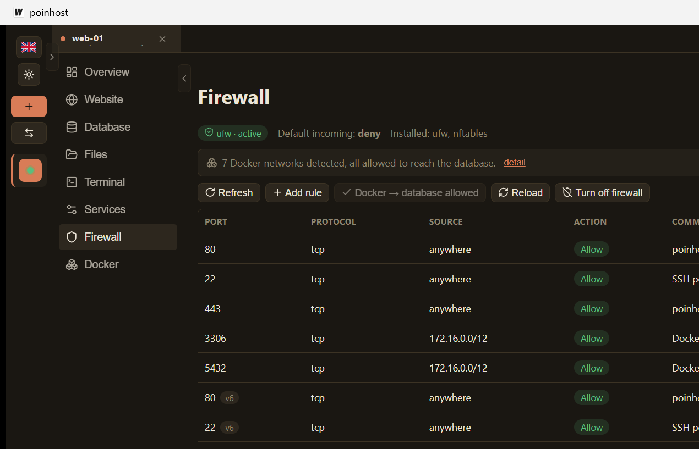
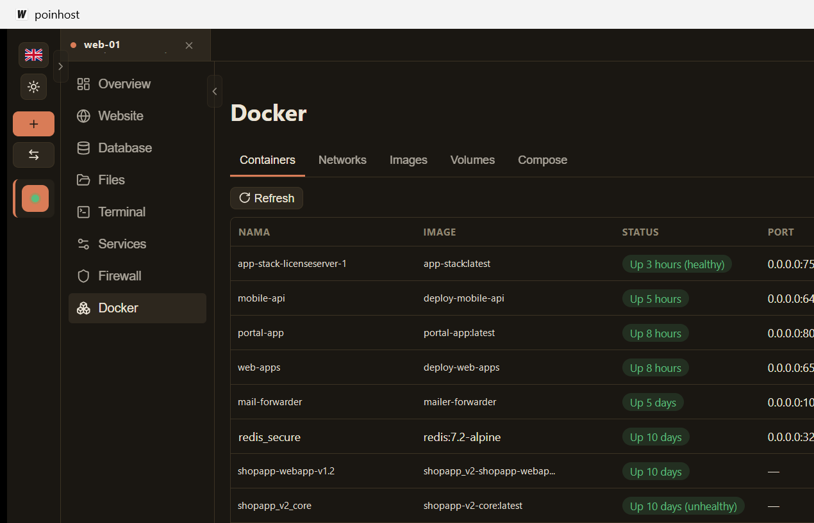

<p align="center">
  
</p>

<p align="center">
  <strong>An open-source alternative to Plesk and cPanel — with nothing to install on the server.</strong>
</p>

<p align="center">
  
  
  
  
</p>

---

## What it is

poinhost is a **desktop application** that manages Linux servers over plain SSH.

Control panels like Plesk and cPanel take over the machine: they install an agent, their own package versions, their own daemons, and they expect to own the box from day one. Migrating away is painful, and putting one on an existing production server is usually out of the question.

poinhost takes the opposite approach. It runs on **your** computer and talks to servers the same way you already do — over SSH, using the same credentials you use in a terminal.

**Nothing is installed on the server. No agent, no daemon, no open port beyond SSH.** Every action is a command that you could have typed yourself; the app just gives it a user interface, remembers the details, and reads the results back.

Because there is nothing to install, you can point it at a server that is already running production workloads, and point it away again with nothing left behind.

## Why agentless matters

| | Plesk / cPanel | poinhost |
|---|---|---|
| Installed on the server | agent, daemons, its own package tree | **nothing** |
| Extra ports exposed | control panel port (8443 etc.) | **none — SSH only** |
| Existing server | usually needs a clean machine | **works on a server already in production** |
| Removing it | uninstall procedure, leftovers | **delete the app** |
| Licence | commercial, per-server | **open source** |
| Where the UI runs | on the server | **on your desktop** |

The server never trusts the app. The app holds no privileges the SSH user does not already have.

---

## Screenshots

> The screenshots below were taken against a live production server, so hostnames and container names are real.

### Overview — the server at a glance

Connection state, OS, uptime, CPU, memory, and disk, collected in a single round trip rather than one call per metric.



### Websites — nginx vhosts, PHP, SSL, proxies

Create domains and subdomains, switch PHP-FPM versions, set up reverse proxies, and issue Let's Encrypt certificates. Certificates are issued **per domain**, so a subdomain whose DNS is not ready yet cannot block certificates for the others.



### Databases — MySQL/MariaDB and PostgreSQL

Users, per-user database access, privileges, and a SQL explorer with pagination. Access is read from the engines' own catalogs — `information_schema` for MySQL, `pg_catalog` with `aclexplode` for PostgreSQL — not from a separate bookkeeping table that can drift out of sync.



### Files — a file manager over SFTP

Browse, upload, download, edit in place, change permissions, compress and extract. Actions can run as another system user when your SSH login is not the file owner.



### Services — systemd units and journald

Start, stop and restart units, and control whether they start at boot. Those are two independent dimensions in systemd, so they are shown as two separate columns rather than one on/off switch. The Logs tab reads `journalctl` with filters for unit, level and time range, so a failing unit can be explained without leaving the app.



### Firewall — ufw and firewalld

The backend is **detected from what is actually running**, never guessed from the distribution: a single server can have ufw, firewalld and nftables installed at once, and writing rules into the inactive one silently protects nothing.

Enabling a firewall always allows the SSH port **first, in the same step**, so the action cannot lock you out of your own server.



### Docker — containers, networks, compose

Inspect and control containers, stream logs and stats, open an exec shell, and edit environment, ports and volumes. Ports can be published **public** (reachable from the internet) or **private** (bound to `127.0.0.1`, reachable only from inside the server) — enforced by the bind address, so it holds regardless of firewall state.



---

## Features

**Servers**
- Multiple servers in tabs, each with its own working state
- Password or SSH key authentication, optional sudo escalation
- Host key fingerprints are shown and must be trusted explicitly; changes are flagged
- Encrypted local backup/restore of the server list

**Websites**
- nginx vhosts for domains and subdomains, enable/disable without deleting
- PHP-FPM version per domain, installed on demand
- Reverse proxy for a whole domain or per path, with WebSocket support
- Let's Encrypt via certbot, per domain, with auto-renew and automatic nginx reload
- DNS zone preview, access/error log streaming, cron jobs, SFTP accounts

**Databases**
- MySQL/MariaDB and PostgreSQL side by side
- Users grouped by name with their hosts, and the databases each one can reach
- Create databases with an owner, grant and revoke access, edit privileges
- SQL explorer with server-side pagination and a CodeMirror editor
- One-click "allow Docker → database" that opens the host firewall only to the Docker bridge subnets actually present

**Docker**
- Containers and networks, with logs and live stats
- Recreate a container from its compose file, so no setting is left behind
- Config drift detection using compose's own verdict

**Firewall**
- ufw and firewalld are editable; raw nftables is reported but not modified
- Docker bridge subnets are detected, not assumed
- Reload without a window where everything is open

**Services**
- systemd units with separate run-state and boot-state
- journald reader with unit, level and time filters, plus live follow

**Terminal & Files**
- Full interactive shell (xterm.js over an SSH PTY)
- SFTP file manager with in-place editing

**Interface**
- English and Indonesian, switchable at runtime
- Light and dark themes

---

## Requirements

**On your computer**
- Windows, macOS or Linux
- Go 1.25+ and Node 18+ *(only to build from source)*

**On the server**
- SSH access — that is the whole list
- A Linux distribution using `systemd`, with `apt` or `dnf/yum`
- Root, or a user with `sudo`, for anything that changes system state

Nginx, PHP, MySQL/MariaDB, PostgreSQL, Docker and certbot are **not** prerequisites. poinhost detects what is present and can install what is missing, using the server's own package manager.

## Build

```bash
git clone https://github.com/andyresta/poinhost.git
cd poinhost
wails dev     # development, with hot reload
wails build   # production binary
```

Requires the [Wails v2 CLI](https://wails.io/docs/gettingstarted/installation).

## How it works

```
┌──────────────────────┐          ┌──────────────────────┐
│   poinhost (desktop) │          │      your server     │
│                      │          │                      │
│  React + TypeScript  │   SSH    │   nginx, php-fpm,    │
│          │           │  ──────▶ │   mysql, postgres,   │
│    Go (Wails v2)     │   :22    │   docker, systemd    │
│                      │          │                      │
│  server list, creds  │          │   no agent installed │
└──────────────────────┘          └──────────────────────┘
```

The Go layer owns a pooled SSH connection per server and runs commands through it. Round trips are treated as the scarce resource: status for a whole panel is usually gathered by one script that prints structured lines, rather than one call per field.

State lives on the server, not in a local database. Domains are read back from the nginx vhost files poinhost itself wrote, database users from the engine catalogs, services from systemd. There is no sync step that can drift, and anything you change by hand over SSH is picked up on the next read.

Credentials are stored locally in an encrypted vault; only the server list and its metadata live in the app's own SQLite file.

## Security

- **Nothing runs on the server.** No agent, no daemon, no extra listening port.
- **No privilege the SSH user lacks.** sudo is used only when you enable it for that server.
- **Host keys are verified.** New and changed fingerprints are surfaced and must be accepted explicitly.
- **Values that reach a shell are whitelisted, not merely escaped.** Unit names, firewall zones, ports, protocols and source CIDRs are validated against strict patterns before any command is built.
- **Destructive actions are confirmed** in a dialog that states what will happen, and the firewall never gets enabled without the SSH port allowed first.

## Status

poinhost is under active development and is used against real production servers. Interfaces may still change between versions.

Not yet implemented: Docker images, volumes and compose sub-tabs; system users and SSH key management; server-level cron; scheduled backups of website and database data; monitoring history and alerts.

## Licence

Not yet chosen — see [Status](#status). Until a `LICENSE` file is added, all rights are reserved by the author.

## Credits

Built with [Wails](https://wails.io), [React](https://react.dev), [xterm.js](https://xtermjs.org) and [CodeMirror](https://codemirror.net).
